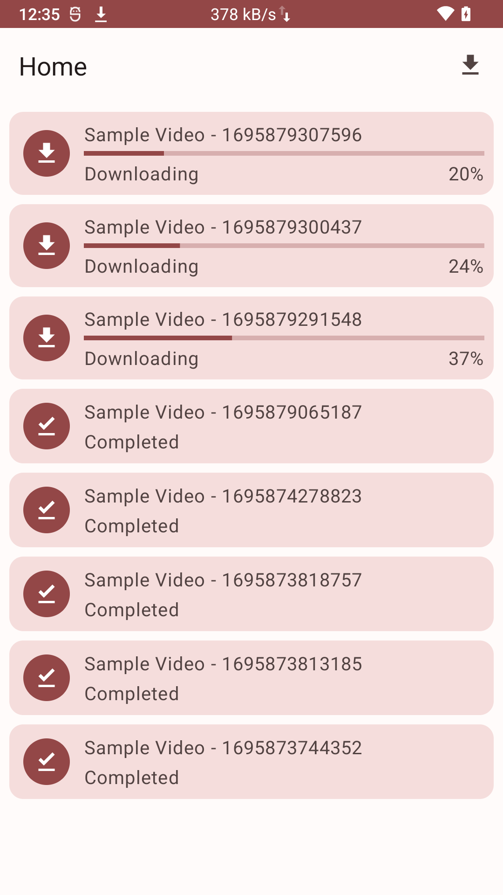
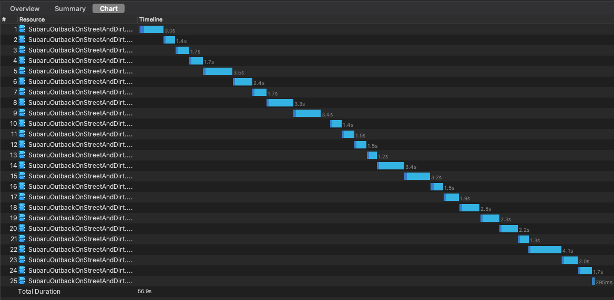
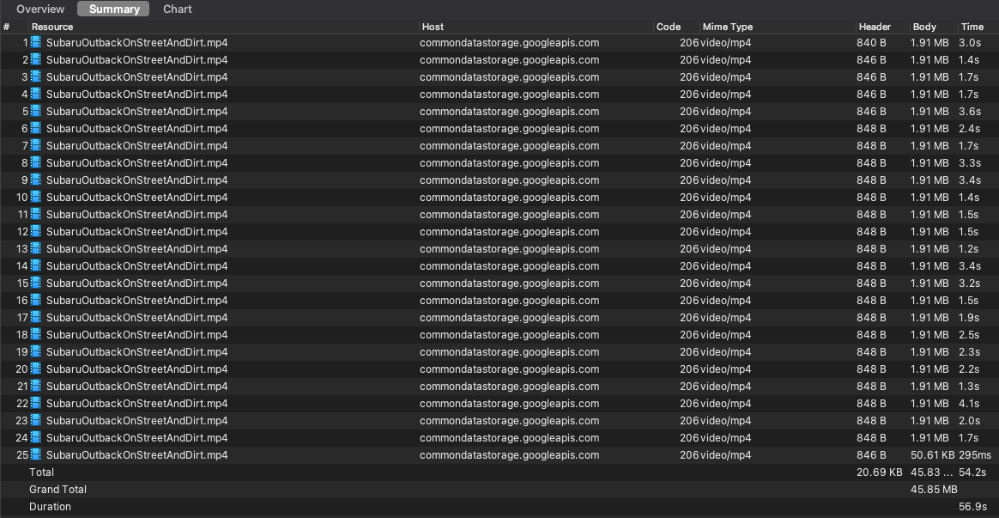

## CkDownloader Android

An Android library for downloading files, particularly videos or audio, using the download segment
chunks method while passing header range bytes. Typically utilized for servers that support header
range bytes, bypass throttle web server and partial stream 206



This is network tracking behind downloading files




### Download
Add it in your root build.gradle at the end of repositories:
``` groovy
    allprojects {
        repositories {
            ...
            maven { url 'https://jitpack.io' }
        }
    }
```
Add the dependency
``` groovy
    dependencies {
        implementation 'com.github.luthfipun:CkDownloader-Android:0.1'
    }
```

### Usage

You can follow sample project on <a href="app/src/main">this</a>

### Notes

- Host server must supported header content length ranges bytes, if not the downloaded file will be
  corrupted
- Not support pause/resume for now, just delete and re-download
- Feel free for pull request :)